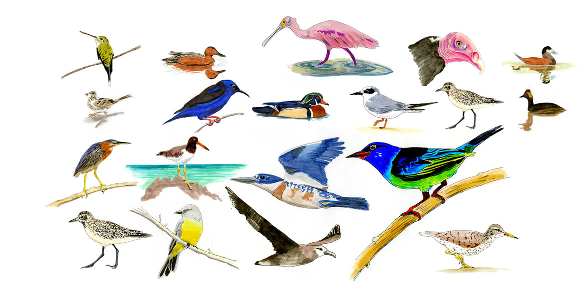
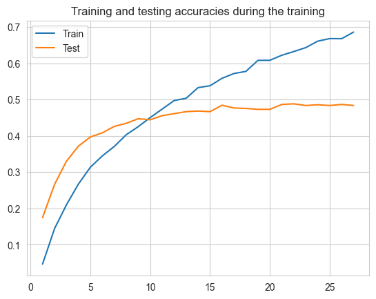
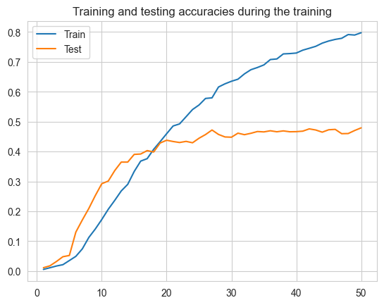

# Birds Classification 

## Overview 
This project amis to classify between 200 types of bird's images using ResNet101.
this project has experiments using the freezed version of resnet and the un freezed one and many comparsons.

## Dataset 
 **Name** : Caltech-UCSD Birds-200-2011  
 **link to download** :<a href="http://www.vision.caltech.edu/visipedia/CUB-200-2011.html">Download</a> 
**Discribtion** :CUB-200-2011 is an extended version of CUB-200 [7], a challenging dataset of 200 bird species. The extended version roughly doubles the number of images per category and adds new part localization annotations. All images are annotated with bounding boxes, part locations, and at- tribute labels. Images and annotations were filtered by mul- tiple users of Mechanical Turk. We introduce benchmarks and baseline experiments for multi-class categorization and part localization. 

To **run** this project you should download the dataset and put the files in the folder 'CUB_200_2011' 

## Methods
#### Preprocessing
As a preprocessing I cropped the images to only the faces of the birds and removed the backgroud to make the model able to focus on the features of the birds themselves not the background. 
Also, applied scaling and resizing.
#### Modeling
Used Resnet vesion 101 which consist of 101 layers and freez theses original layers and adding some additional layers to achive a new good architecture. 
Also,try to train the whole model from scratch and aslo adding some layers.
## Results
#### Freezed model 

#### Unfreezed model

### From these results the two model are overfitted but the freezed model is qiut better

#### To download the my trained models you can find them here 
<a href="https://uottawa-my.sharepoint.com/personal/kataa028_uottawa_ca/_layouts/15/guestaccess.aspx?folderid=06a40d0a82c2b4db58132f8c5c3ae5eb1&authkey=AcDdgAZtO5mUj30ajtUGPE4&e=ZLucFh">Download</a> 
